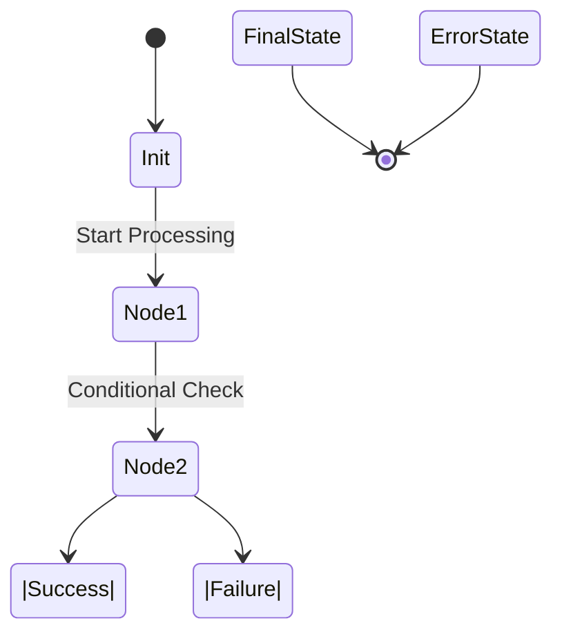

# **LangGraph Scraper Suite**

## 1. Title & High-Level Overview
**LangGraph Scraper Suite**

This application is a sophisticated scraping and data processing tool designed for developers and data scientists. It aggregates articles and videos from Anthropic, OpenAI, and YouTube, solving the challenge of efficiently gathering and structuring large volumes of data for analysis.

| Technology    | Description                                      |
|---------------|--------------------------------------------------|
| **FastAPI**   | Asynchronous web framework for building APIs     |
| **Docker**    | Containerization for consistent environments     |
| **Postgres**  | Relational database for structured data storage  |
| **SQLAlchemy**| ORM for database interactions                    |
| **LangGraph** | Stateful orchestration for agent workflows       |

## 2. Key Features
- 🚀 **Asynchronous FastAPI Backbone**: High-performance API handling.
- 🗄️ **Robust SQLAlchemy Schema**: Manages complex relational data.
- 🤖 **LangGraph Orchestration**: Stateful, agentic workflow management.
- 📈 **Scalable Architecture**: Designed for high data throughput.
- 🔄 **Containerized Deployment**: Easy setup and scaling with Docker.

## 3. Repository Architecture & Project Structure
```
.
├── app/                    # Core application logic
│   ├── scrapers/           # Scrapers for various data sources
│   ├── main.py             # FastAPI application entry point
├── config/                 # Configuration files and settings
├── database/               # Database models and migrations
├── agents/                 # LangGraph agent definitions
├── tests/                  # Unit and integration tests
```

## 4. LangGraph Agent Workflows (System Design)

- **State Management**: The `StateDict` maintains the current state and context, allowing seamless transitions between nodes.
- **Node Transitions**: Each node processes data and updates the `StateDict`, ensuring data integrity and flow continuity.

## 5. Getting Started & Local Installation

### Pathway A: The Containerized Stack (Recommended)
- **Prerequisites**: Docker and Docker Compose installed.
- **Steps**:
  1. Clone the repository:
     ```bash
     git clone <repository-url>
     cd <repository-directory>
     ```
  2. Configure environment variables in `.env`.
  3. Build and start the stack:
     ```bash
     docker-compose up --build
     ```

### Pathway B: The Native Local Environment (For Debugging)
- **Steps**:
  1. Create and activate a Python virtual environment:
     ```bash
     python3 -m venv venv
     source venv/bin/activate
     ```
  2. Install dependencies:
     ```bash
     pip install -r requirements.txt
     ```
  3. Start a local Postgres instance and set environment variables.
  4. Run the ASGI server:
     ```bash
     uvicorn app.main:app --reload
     ```

## 6. Configuration & Environment Variables
| Variable Name     | Required/Optional | Example Value          | Description/Purpose                      |
|-------------------|-------------------|------------------------|------------------------------------------|
| `POSTGRES_USER`   | Required          | `user`                 | Username for Postgres database           |
| `DATABASE_URL`    | Required          | `postgres://...`       | Connection URL for the database          |
| `OPENAI_API_KEY`  | Optional          | `sk-...`               | API key for accessing OpenAI services    |

## 7. Core API Endpoints Reference
| HTTP Method | Endpoint Path          | Request Payload (JSON structure) | Response Codes / Description            |
|-------------|------------------------|----------------------------------|-----------------------------------------|
| GET         | /health                | N/A                              | 200 OK - Health check                   |
| GET         | /articles/anthropic    | N/A                              | 200 OK - List of Anthropic articles     |
| GET         | /articles/openai       | N/A                              | 200 OK - List of OpenAI articles        |
| GET         | /videos/youtube        | N/A                              | 200 OK - List of YouTube videos         |

## 8. Database Management & Migrations
- **Initialization**: Ensure the Postgres container is running.
- **Migrations**: Use Alembic for database migrations.
- **Commands**:
  1. Generate a new migration:
     ```bash
     alembic revision --autogenerate -m "Migration message"
     ```
  2. Apply migrations:
     ```bash
     alembic upgrade head
     ```
